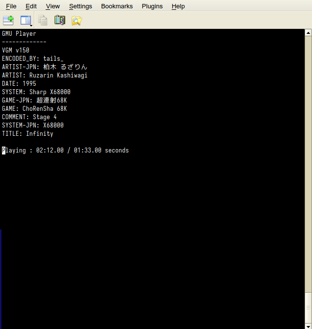

# gmu
video game music file cli player. See [libgme](https://github.com/mcfiredrill/libgme) and [libvgm](https://github.com/ValleyBell/libvgm) for supported formats.



## Dependencies
- [libgme](https://github.com/mcfiredrill/libgme)
    - macOS: `brew install libgme`
    - Ubuntu/Debian: `apt install libgme-dev`
- [libvgm](https://github.com/ValleyBell/libvgm)
- [portaudio](https://www.portaudio.com/)
    - macOS: `brew install portaudio`
    - Ubuntu/Debian: `apt install portaudio19-dev`

## Build
Pull git submodules: `git submodule update --init --recursive`. Then run `make`.

## Controls
```
> next file
< prev file
. next track (if applicable)
, prev track (if applicable)
p pause
L toggle loop
SPC toggle play
```

## TODO/Known Issues
- tiny tracks (less than 4 seconds) fail to fadeout
- VGM/VGZ files that are not SMS/Genesis output silence (likely unsupported by libgme)
    - Mitigated by using libvgm alongside libgme
- configure script to make it simpler to install dependencies? (especially libvgm)
