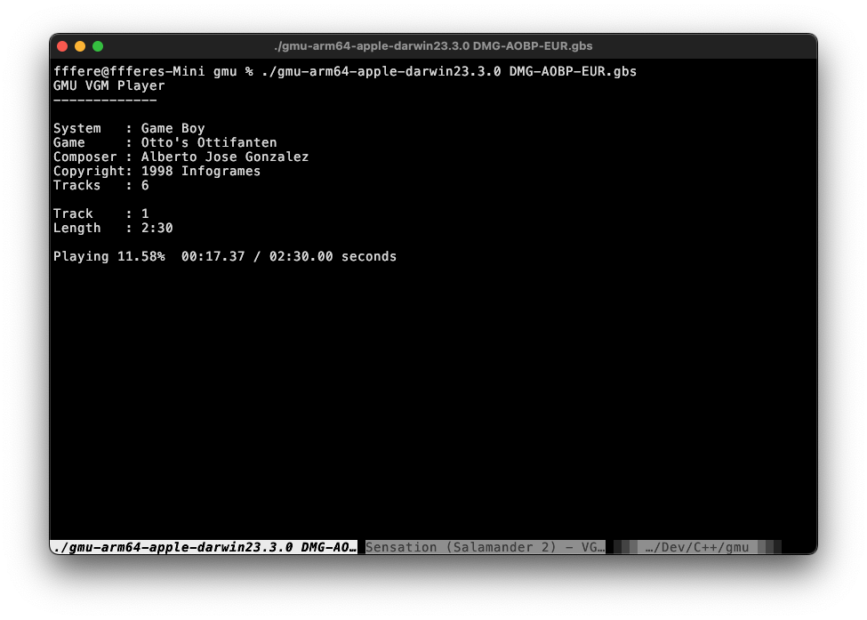

# gmu
vgm cli player



## Dependencies
- [libgme](https://github.com/mcfiredrill/libgme)
    - macOS: `brew install libgme`
    - Ubuntu: `apt install libgme-dev`
- [portaudio](https://www.portaudio.com/)
    - macOS: `brew install portaudio`
    - Ubuntu: `apt install portaudio19-dev`

## Build
Pull git submodules: `git submodule update --init --recursive`. Then run `make`.

## Controls
```
n next track
b prev track
p pause
. skip forward 5 seconds
, skip backwards 5 seconds
```